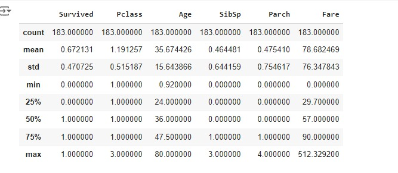

# EXNO2DS
# AIM:
      To perform Exploratory Data Analysis on the given data set.
      
# EXPLANATION:
  The primary aim with exploratory analysis is to examine the data for distribution, outliers and anomalies to direct specific testing of your hypothesis.
  
# ALGORITHM:
STEP 1: Import the required packages to perform Data Cleansing,Removing Outliers and Exploratory Data Analysis.

STEP 2: Replace the null value using any one of the method from mode,median and mean based on the dataset available.

STEP 3: Use boxplot method to analyze the outliers of the given dataset.

STEP 4: Remove the outliers using Inter Quantile Range method.

STEP 5: Use Countplot method to analyze in a graphical method for categorical data.

STEP 6: Use displot method to represent the univariate distribution of data.

STEP 7: Use cross tabulation method to quantitatively analyze the relationship between multiple variables.

STEP 8: Use heatmap method of representation to show relationships between two variables, one plotted on each axis.

## CODING AND OUTPUT:
```python
import pandas as pd
df=pd.read_csv("/content/titanic_dataset.csv")
df
```


```python
df.isnull().sum()
```


```python
df.dropna(inplace=True)
df
```


```python
df.isnull().sum()
```


```python
df.info()
```


```python
df.shape
```


```python
df.set_index("PassengerId",inplace=True)
df.describe()
```


```python
df
```


```python
df.nunique()
```


```python
df["Survived"].value_counts()
```


```python
percentage=(df["Survived"].value_counts()/df.shape[0]*100).round(2)
percentage
```


```python
import numpy as np
import matplotlib.pyplot as plt
import seaborn as sns
```

```python
sns.countplot(data=df,x="Survived")
```


```python
df.Pclass.unique()
```


```python
sns.catplot(x="Sex",col="Survived",kind="count",data=df,height=5,aspect=.7)
```


```python
sns.catplot(x='Survived',hue="Sex",data=df,kind="count")
```


```python
sns.catplot(data=df,col="Survived",x="Sex",hue="Pclass",kind="count")
```


# RESULT:
        The Exploratory Data Analysis on the given data set has been performed.
